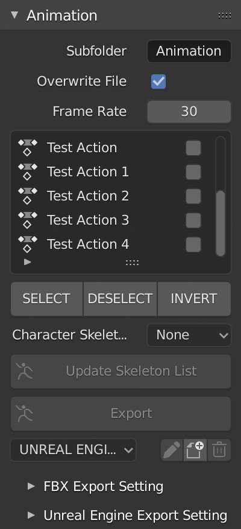

# Export Animation

Export animation panel.

## Subfolder

Subfolder for animation export folder, leave it blank if you want to export to root project folder.

## Character Skeleton

!!! info
    Character skeleton must be assign for export animation to Unreal Engine.

Assign skeleton for export to Unreal.

## Export Setting

Export setting FBX Blender and Unreal Engine.

!!! info
    Come with Unreal Engine profile that make best setting for export.

### Export Profile

!!! info
    This feature available in `v.1.2`.

Allow you to change export setting and save into a profile.