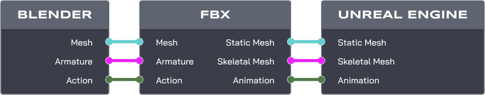
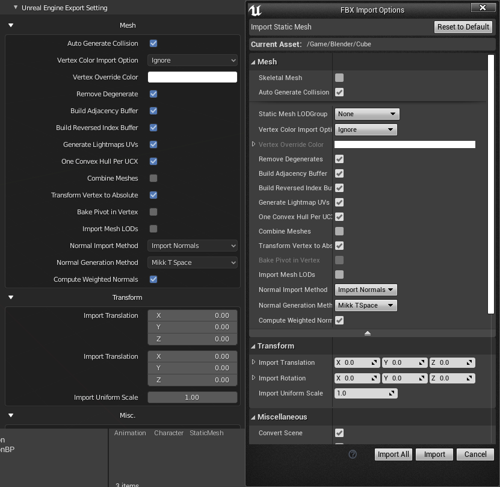
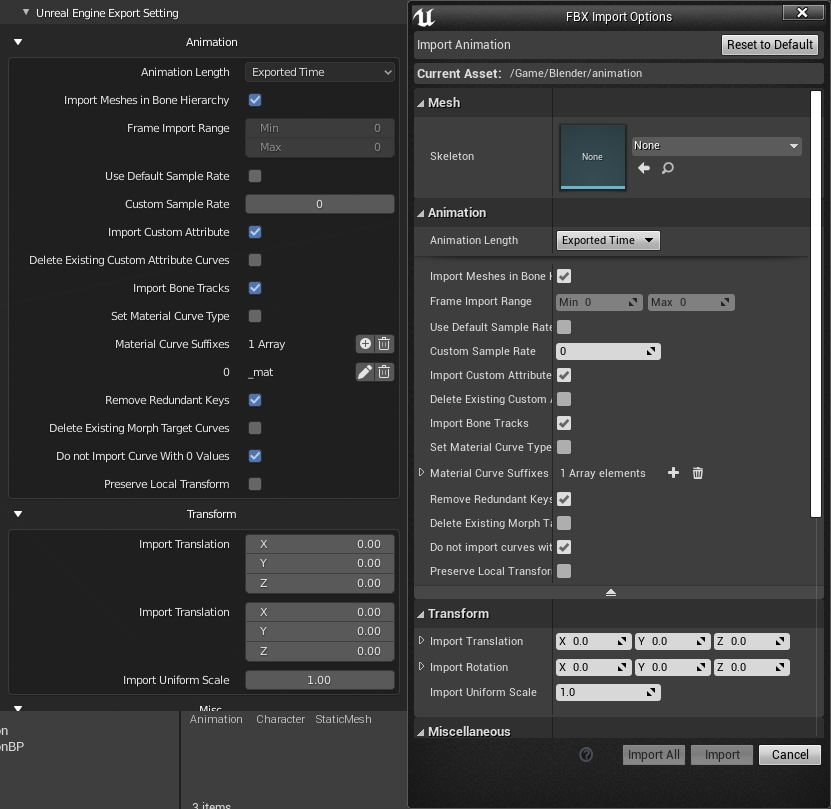
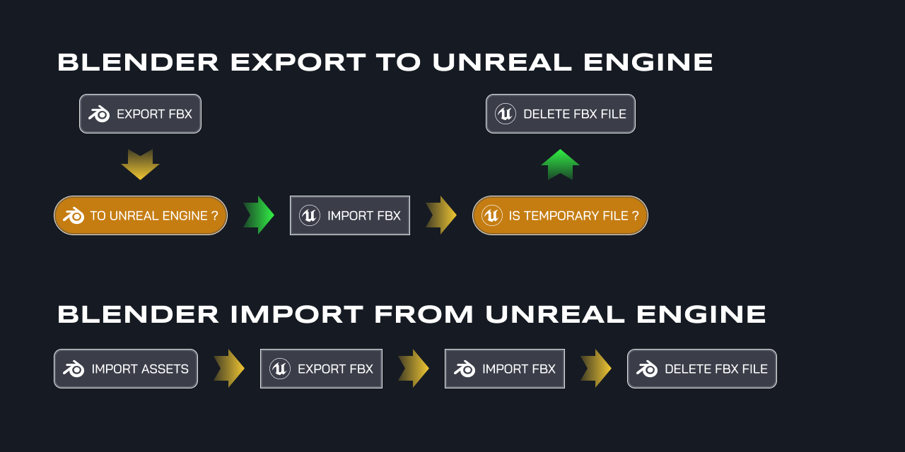

# Overview


Blender **2.8x** *(above)* add-on for export directly to Unreal Engine 4 with all setting in Blender (inspired by **send to unreal** add-on).

## Feature

Allow you export static mesh, skeletal mesh, and animation with single click directly to Unreal Engine 4 or to FBX file.



### Static Mesh

Export for Static Mesh.

- Export to FBX and Unreal Engine
- Custom collision from vertices
- Custom collision from mesh - ```v.1.2```
- Custom lightmaps
- Export profile - ```v.1.2```
- Socket System - ```v.1.3```
- Level of Detail - ```v.1.4```
- Import Static Mesh From Unreal Engine ```v.1.4```

Export and import setting in Blender.



### Skeletal Mesh

Export for Character (Skeletal Mesh).

- Export to FBX and Unreal Engine  
- Modular character
- Skeleton preset (Epic skeleton)
- Add twist bone for skeleton preset - ```v.1.2```
- Generate rig for skeleton preset - ```v.1.2```
- Export profile - ```v.1.2```
- Socket System (**Not Support Export**) - ```v.1.3```
- Character Part Manager ```v.1.4```
- Import Skeletal Mesh From Unreal Engine ```v.1.4```

Export and import setting in Blender.


### Animation

Export for Animation.

- Export to FBX and Unreal Engine - ```v.1.2```  
- Export profile - ```v.1.2```
- Import Animation From Unreal Engine ```v.1.4```

Export and import setting in Blender.



### Retarget Animation

Retarget Animation to another skeleton - ```v.1.3``` **Experimental**, ```v.1.4``` **Production Ready**

## How it works

Unreal Engine 4 allow to remote execute python script, with that we can execute python script import assets (FBX File) to Unreal Engine 4.



## Compatibility Test

* **2.81** - **DROP** from version `v.1.3`

* **2.82** - **DROP** from version `v.1.4`

* **2.83** (make sure export folder path is absolute)

* **2.90** Alpha (make sure export folder path is absolute)

using Blender latest version for better compatibility.