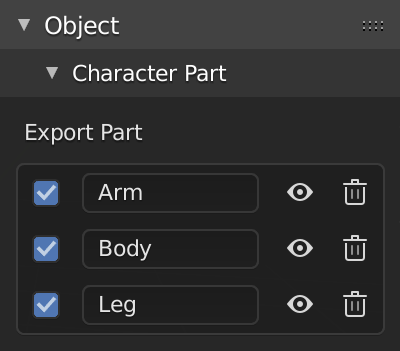

# Modular Character

## Character Part

!!! info
    This feature available in `v.1.4`.

Character part panel in object panel.

## Export Part

You can manage mesh that you want to export (combine or part).

!!! note ""
    <iframe width="760" height="415" src="https://www.youtube.com/embed/5S-JYsETBBY" frameborder="0" allow="accelerometer; autoplay; encrypted-media; gyroscope; picture-in-picture" allowfullscreen></iframe>