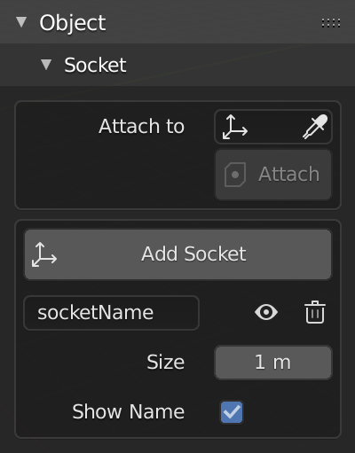

# Socket

!!! info
    This feature available in `v.1.3`.

Socket panel in object panel.

## Add Socket

Create socket point on object base on 3D Cursor location.

!!! note ""
    <iframe width="760" height="415" src="https://www.youtube.com/embed/Fmq8c-IS86o" frameborder="0" allow="accelerometer; autoplay; encrypted-media; gyroscope; picture-in-picture" allowfullscreen></iframe>

## Attach To Socket

Attach object `#!python ["MESH", "ARMATURE"]` to socket.

!!! note ""
    <iframe width="760" height="415" src="https://www.youtube.com/embed/JFauCjAH_eI" frameborder="0" allow="accelerometer; autoplay; encrypted-media; gyroscope; picture-in-picture" allowfullscreen></iframe>