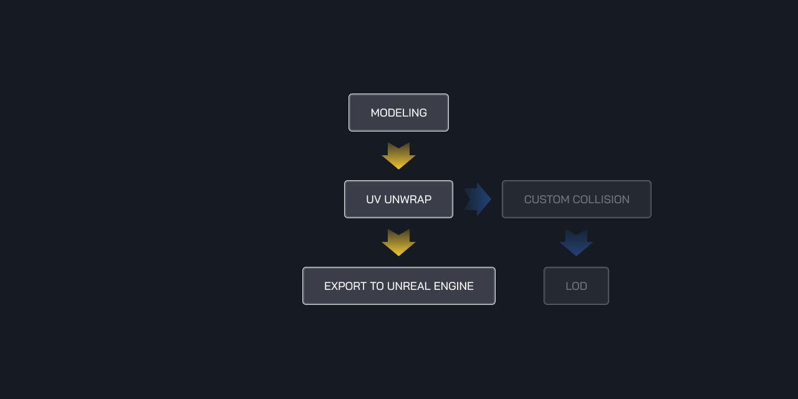

# Export Static Mesh

Export static mesh panel.

## Subfolder

Subfolder for static mesh export folder, leave it blank if you want to export to root project folder.

## Export Mesh Option

* **Select**

    Export selected mesh on scene.

* **All**

    Export all mesh on Scene.

## Mesh Origin

* **Object**

    Use object origin.

* **Scene**

    Use scene origin.

## Custom Collision

Export mesh with custom collision (if exist), if object mesh does not have any custom collision it will use `Auto Generate Collision` in Unreal Engine Export Setting.

## Socket

!!! info
    This feature available in `v.1.3`.

Export mesh with socket (if exist).

## Level Of Detail

!!! info
    This feature available in `v.1.4`.

Export mesh with level of detail (if exist), if object mesh does not have any lod it will use `Import Mesh LODs` in Unreal Engine Export Setting.

## Export Setting

Export setting FBX Blender and Unreal Engine.

!!! info
    Come with Unreal Engine profile that make best setting for export.

### Export Profile

!!! info
    This feature available in `v.1.2`.

Allow you to change export setting and save into a profile.

## Tips and Tricks

### Workflow

My static mesh workflow.

!!! note ""
    

### Custom Lightmaps

How to create custom lightmaps in Blender.

!!! note ""
    Create UV map name it "**Lightmap**"

!!! note ""
    <iframe width="760" height="415" src="https://www.youtube.com/embed/tXwpVNWHB7c" frameborder="0" allow="accelerometer; autoplay; encrypted-media; gyroscope; picture-in-picture" allowfullscreen></iframe>
