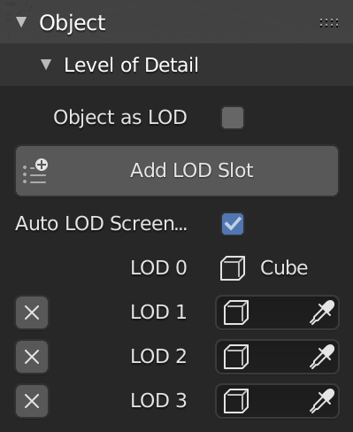

# Level of Detail

!!! info
    This feature available in `v.1.4`.

Level of Detail panel in object panel.

## Object as LOD

Enable object (mesh) for LOD, allow you to assign the object in LOD slot.

## LOD Slot

You can have max. 7 slot LODs.

## Auto LOD Screen Size

If `#!python True` it will automatically computed each screen size LODs on Unreal Engine, if `#!python False` you can assign each screen size LODs manually in Blender.

## Tips and Tricks

### How To Create LOD

How I create LOD in Blender using Decimate Modifier.

!!! note ""
    <iframe width="760" height="415" src="https://www.youtube.com/embed/38d5Myrh3ic" frameborder="0" allow="accelerometer; autoplay; encrypted-media; gyroscope; picture-in-picture" allowfullscreen></iframe>
